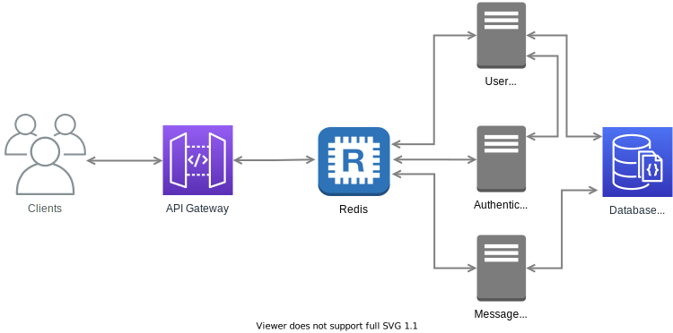

  

   
  
  

An example messaging service Node.js backend with microservices architecture. Used NestJS, Redis, Docker, Swagger and Passport libraries and technologies. 

---

# Messaging Service

  

## Running the Project

### Docker

Just use `docker-compose up -d` at the root of the repository. Once the services are running the Swagger UI API docs can be viewed at
`localhost:3000/`

Also you can use `docker-compose -f docker-compose.develop.yml up -d` for starting only Redis and MongoDB services.

### Locally

Make sure that you've copied over the `.env.example` file for each service into `.env` so that the services can be configured properly.

For each service, go to root folder of the service and run following commands:

- `yarn install`
- `yarn start`

For test covarage report use `yarn test:cov`

### Making changes to Services

If you've made a change to a service and want to redeploy it with docker compose without bringing down the other services,
just use `docker-compose up -d --no-deps --build <serviceName>` where serviceName is one of the named services from the
docker-compose.yml file.

## REST API

This project uses Swagger OpenAPI for API documentation. All routes and descriptions could be found interactively at `localhost:3000/`

API endpoints and other details could be found in [README-API.md](README-API.md).

## License

The code in this project released under the [MIT License](LICENSE).
